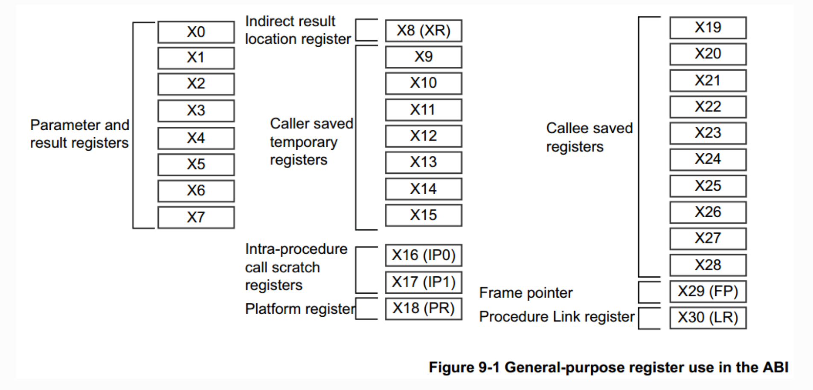

# Linux内核漏洞攻防 - ROP攻击与防护

## 1. 实验目的

* 了解 ARM64 栈的布局，学习 buffer overflow 漏洞的原理与利用方式
* 了解 stack canary 与 KASLR 等抵御 buffer overflow 漏洞的原理，并学会如何绕过这些防护机制
* 学习 return-oriented programming (ROP) 攻击原理，获取 Linux 内核的 root 权限
* 学习 ARMV8.3 PA (Pointer Authentication)原理，了解 Linux 内核如何利用 PA 机制防止 ROP 攻击

## 2.实验工具

* qemu-system-aarch64
* gdb-multiarch
* aarch64-linux-gnu-objdump
* aarch64-linux-gnu-gcc

## 3. 背景介绍

## 3.1 ARM64 汇编

ARM64 支持 EL0-EL3 四个特权级，EL0 特权级最低，EL3 最高。一般情况下，EL1 运行 Linux 内核，EL0 运行用户态程序。

#### ARM64 寄存器

* 31个通用寄存器，每个寄存器都为 64bit 大小，可以通过 x0-x30 访问，同时可以通过 w0-w30 来访问这些寄存器的低32位。其中，x29寄存器(fp)用于保存栈帧基地址，x30寄存器也叫link register（lr），用于保存返回上一个函数的返回地址。
* XZR（值始终为0，WZR 对应32位零寄存器），SP（栈指针），PC（程序计数器）。其中，SP 为逻辑寄存器，会映射到 SP_ELx （0 <= x <= 3）四个寄存器上。根据 PSTATE.SPSel 决定当前使用的物理寄存器。一般来说，用户态程序位于EL0，使用 SP_EL0；内核位于 EL1，使用 SP_EL1。
* PSTATE，SP_ELx 等系统寄存器。

> ⚠️ 注意 哪些寄存器是在一个函数中可以被随意改写的，哪些是需要保存到栈上之后才能改写的





#### ARM64 指令

* mov 指令。将数据从一个寄存器移动到另一个寄存器，或者将一个立即数加载到寄存器。

```arm
mov x1, 8   // x1 = 8
mov x2, x1  // x2 = x1
```

* 数据处理指令，如 add, sub, and, or 等。

```arm
add x1, x8, x9              // x1 = x8 + x9
add x8, x9, #0x30           // x8 = x9 + 0x30
add x19, x24, x20, lsl #3   // x19 = x24 + x20 << 3
```

* 访存与寻址指令

```arm
str x0, [sp, #104]              // *(sp + 104) = x0 
str x2, [x1, #4]!               // x1 = x1 + 4, *(x1) = x2 (注意写入地址为加上4后的x1)
stp x0, x1, [sp]                // *(sp) = x0, *(sp + 8) = x1

ldr x19, [x19, #40]             // x19 = *(x19 + 40)
ldr x20, [x21, x19, lsl #3]     // x20 = *(x21 + x19 << 3)
ldp x29, x30, [sp], #352        // x29 = [sp], x30 = [sp + 8], sp = sp + 352

adrp x0, ffff800011c44000 <init_task+0xb40>  // x0 = 0xffff800011c44000，注意仅仅获取地址，不实际进行访存操作
```

* 比较与跳转指令

```arm
b ffff800010013860 <user_enable_single_step+0x38>       // 无条件跳转
cbz x19, ffff80001001399c <ret_from_fork+0x10>          // 条件跳转，若 x19 == 0 则跳转到0xffff80001001399c

cmp w0, w3                                                        // 比较 w0 与 w3 寄存器，该指令进行w0 - w3运算，根据运算结果，设置 PSTATE 中的N位（结果为负）或者Z位（结果为0）
b.eq    ffff800010013b80 <find_supported_vector_length+0x78>      // 条件跳转，如果 PSTATE 中的Z位为1,那么跳转
```

* 函数调用与返回指令

  * bl 指令将 PC + 4 写入x30，并跳转到目标函数（直接跳转）
  * blr 指令将 PC + 4 写入x30，并跳转到目标函数，跳转位置由寄存器指定（间接跳转）
  * ret 指令将 x30(lr) 寄存器写入 PC，跳转到 caller 的下一条指令位置

```arm
bl ffff800010deeab8 <asm_exit_to_user_mode>
blr x1
ret
```

* mrs/msr 指令
  ARM64 不允许通过mov指令来读写系统寄存器，只能使用 mrs 和 msr 指令。

```asm
mrs x20, sp_el0         // sp_el0 的值拷贝到 x20
msr mdscr_el1, x20      // x20 的值拷贝到 mdscr_el1
```

### 3.2 ARM64 Stack Layout

每一次函数的调用都会在栈上维护一个栈帧，保存该函数调用的信息。下面的图展示了 ARM64 架构中栈的布局。栈的增长方向为从高地址到低地址。在函数开始处，首先分配局部变量的内存空间，r然后将 callee-saved 寄存器 push 到栈上，最后将 lr 和 fp 寄存器 push 到栈上（注意这里和x86/x64的不同）。在函数返回前，恢复 lr, fp 和 callee-saved 寄存器的值，并回收栈空间。

根据栈帧的布局，当攻击者利用某个局部变量的缓冲区溢出漏洞时，覆盖的是上一个函数栈帧的 x29 和 x30。

```

                               ┌────────────────┐
                               │                │
       High Addr │             │                │
                 │             │                │
                 │             │      ...       │
                 │             │                │    caller function
                 │             │      x30       │
                 │             │                │
                 │             │      x29       │
                 │             ├────────────────┤
                 │             │    local var   │
                 │             │                │
                 │             │  callee-saved  │
                 │             │                │    callee fucntion
                 │             │       x30      │
       Low Addr  │             │                │
                 │             │       x29      │
                 ▼    ───────► └────────────────┘
                        sp/fp


```

值得注意的是，ARM64 中和 x86-64 不同，没有提供 push 和 pop 指令，可以通过 str 指令和 ldr 指令实现 push 和 pop。

```asm
stp x29, x30, [sp, #-32]!
mov x29, sp
str x19, [sp, #16]

...

ldr x19, [sp, #16]
ldp x29, x30, [sp], #32
ret
```

这段代码展示了某个函数开始处和返回前的代码。在函数开始处，将 sp 减去32，也就是在栈上分配了32字节的空间，将 x29 保存在[sp], 在 x30 保存在[sp + 8], 将该函数要用到的 callee-saved 寄存器 x19 保存在[sp + 16]。

在函数返回前，分别从栈上恢复 callee-saved 寄存器和 x29, x30 寄存器的值，并将 sp 加上32，也就是回收32字节的空间。

### 3.3 相关安全机制

#### KASLR

KASLR(Kernel address space layout randomization) 是 Linux 内核的一个安全机制，该机制可以让内核每次启动时，随机生成一个偏移量，内核镜像的链接地址加上这个偏移才是内核镜像最终映射的虚拟地址。该机制使内核符号的地址变得随机，增大了攻击者获取内核符号地址的难度，无法轻易发起 ROP 等攻击。

然而，攻击者仍然可以绕过 KASLR。攻击者能够利用内核中的信息泄露漏洞获取某个函数所在的虚拟地址，通过与编译内核时产生的链接地址相减，就可以获取本次运行生成的偏移值，从而获取了内核所有函数的虚拟地址。

#### canary

stack canary 是一种用于防范栈缓冲区溢出攻击的安全机制。当一段内存被拷贝到栈上的局部变量时，如果拷贝长度是由用户控制的且没有检查长度的合法性时，攻击者可以覆盖掉位于缓冲区上方的返回地址，从而实现控制流劫持。为了防范该类攻击，Linux 内核引入了 stack canary 。支持canary的栈布局如下图所示，canary位于局部变量上方。

```

                                   ┌────────────────┐
                                   │                │
           High Addr │             │                │
                     │             │                │
                     │             │      ...       │
                     │             │                │    caller function
                     │             │      x30       │
                     │             │                │
                     │             │      x29       │
                     │             ├────────────────┤
                     │             │     canary     │
                     │             │                │
                     │             │    local var   │
                     │             │                │    callee fucntion
                     │             │  callee-saved  │
           Low Addr  │             │                │
                     │             │       x30      │
                     ▼             │                │
                          ───────► │       x29      │
                            sp/fp  └────────────────┘

```

stack canary 在函数的开始时push到栈上，在函数返回前，检查是否被篡改。假如攻击者通过缓冲区溢出漏洞覆盖了栈上的返回地址，那么 stack canary 肯定也被覆盖。函数在返回前检查发现 stack canary 的值被篡改，则说明栈的内容已被破坏，内核直接 panic。

然而，stack canary 安全机制也是可以被绕过的。在内核实现中，stack canary 是 per-task 的，也就是说一个进程所有栈帧的 stack canary 的值都是相同的，如果攻击者通过缓冲区溢出读泄露了某个栈帧的 canary ，那么攻击者在发起针对该进程的缓冲区溢出攻击时，就可以将 stack canary 覆盖为合法值，从而绕过 stack canary 的检查。

通常获得canary的手段有

- 通过越界读
- 通过overflow，读取原字符串能带出canary
- 不能读取的时候，且符合Blind ROP的条件时，通过overflow高效爆破


### 3.4 cred结构体

在 Linux 内核中，结构体 cred 记录了进程的权限，该结构体保存了该进程的 uid, gid 等信息（Linux 用 task_struct 结构来管理每个进程，该结构体中有个成员指向 cred）。如果攻击者能够修改进程的 cred 结构体，将 uid 等字段修改为0,该进程就拥有了 root 权限。

Linux 内核主要通过以下两个API修改进程权限：

其中 prepare_kernel_cred 函数用于构造新的 cred 结构体，当给该函数传递的参数为 NULL 时，该函数会构造一个拥有 root 权限的 cred 结构体；

commit_cred 函数用于给当前进程设置新的 cred 结构体。通过调用 commit_creds(prepare_kernel_cred(0)) ,就能将当前进程的权限修改为 root 权限。

## 4.实验环境与介绍

### 4.1 实验环境

本次实验提供了两种方式进行环境配置，任选一种

1.VirtualBox 虚拟机（⚠️注意arm mac无法正常运行这个虚拟机，windows可以），虚拟机环境为 Ubuntu20.04，用户名和密码均为 syssec。

  - 点击[天翼网盘链接](https://cloud.189.cn/t/EvY32uzimEbm),访问码：8yzw，下载虚拟机（可以用直链助手生成直链进行下载）

2.如果你嫌下载、安装虚拟机麻烦或是arm mac，就下载**不包含虚拟机的源文件** `lab1-source.zip`

  - 点击[天翼网盘链接](https://cloud.189.cn/web/share?code=zy2ENz7fiUrq)，访问码：xa2r

虚拟机内包含了完成本次实验所需要的各种环境。本次实验的文件保存在虚拟机 `~/lab1`目录中。

```bash
syssec@VM:~/lab1$ tree -L 1
.
├── Image
├── linux-5.15
├── rootfs.cpio.gz
├── share
├── start.sh
└── vmlinux

2 directories, 4 files
```

其中，`Image` 和 `vmlinux` 是有漏洞的内核镜像，`rootfs.cpio.gz` 是简易的文件系统，`linux-5.15` 目录是整个内核的源代码，`start.sh` 是启动内核的脚本，`share`目录是 qemu 和宿主机的共享目录。为了快速启动内核，方便同学们调试，使用了简易的文件系统，缺乏常用的命令。同学们可以在宿主机内编写、编译 PoC 程序，并拷贝到 `share` 目录中，允许在 qemu 中访问。

### 4.2 实验介绍

本实验提供了一个有 buffer overflow 漏洞的 driver，可以通过 /dev/zjubof 访问。该驱动提供了 read, write 两种接口，通过这两个接口，用户可以触发 buffer overflow 漏洞并通过 ROP 攻击获取 Linux 内核的 root 权限。该 driver 的使用案例如下：

```C
int fd = open("/dev/zjubof", O_RDWR);  //打开该设备，返回文件描述符fd

if (fd < 0)
{
    perror("open fail\n");
    return -1;
}

int len = 0;
char buf[50] = "hello";
len = write(fd, buf, 5);    // 将 buf 的内容写入该 driver，长度为5字节
len = read(fd, buf, 48);    // 从 driver 中读取48字节的内容，结果保存到 cmd。

close(fd);                  //关闭该设备
```

我们编写的驱动位于 `drivers/misc/bofdriver.c` 中，`zjubof_read` 函数在用户调用 `read` 函数时被调用，`zjubof_write` 函数在用户调用 `write` 函数时被调用。

`zjubof_write` 函数最终调用了 `zjubof_write4` 函数，该函数的参数 `len` 控制了拷贝的长度，存在 buffer overflow write 漏洞。

`zju_read` 函数读取的内容是全局变量 `prev.cmd` ，该值由 `zjubof_write4` 填充，`zjubof_write4` 函数存在 buffer overflow read 漏洞。请同学们思考如何控制 cmd.length 的值，从而泄露 canary 和 lr。

### 4.3 GDB 调试内核

#### 4.3.1 步骤

修改 `start.sh` 脚本，加上 `-s` 选项。由于内核开启了 KASLR 机制，GDB无法打断点，因此在用 GDB 调试时，需要关闭 KASLR，具体命令如下：

```bash
qemu-system-aarch64 -M virt \
	-cpu max \
	-smp 2 \
	-m 512 \
	-kernel ./Image \
	-nographic \
	-append "console=ttyAMA0 root=/dev/ram rdinit=/sbin/init nokaslr" \ # 关闭 KASLR
	-initrd ./rootfs.cpio.gz\
        -fsdev local,security_model=passthrough,id=fsdev0,path=./share\
	-device virtio-9p-pci,id=fs0,fsdev=fsdev0,mount_tag=hostshare \
	-s \ # 允许gdb通过端口1234进行调试
```

`gdb-multiarch` 命令没有在虚拟机环境中安装，通过 `sudo apt install gdb-multiarch` 命令安装。

使用命令如下：

```bash
#第一个 shell
./start.sh

sudo apt install gdb-multiarch

#第二个shell
gdb-multiarch vmlinux
(gdb) target remote :1234

# 接下来就可以打断点调试了
```

[gef](https://github.com/hugsy/gef) 是 GDB 的一个插件，同学们可以去下载使用。

如果想要在 GDB 调试过程中观察汇编代码对应的C源码，可以将 `vmlinux` 移到 Linux内核源码目录 `linux-5.15` 中。

#### 4.3.2 GDB 常用命令

* (gdb) layout asm: 显示汇编代码
* (gdb) start: 单步执行，运行程序，停在第一执行语句
* (gdb) continue: 从断点后继续执行，简写 c
* (gdb) next: 单步调试（逐过程，函数直接执行），简写 n
* (gdb) step instruction: 执行单条指令，简写 si
* (gdb) run: 重新开始运行文件（run-text：加载文本文件，run-bin：加载二进制文件），简写 r
* (gdb) backtrace：查看函数的调用的栈帧和层级关系，简写 bt
* (gdb) break 设置断点，简写 b
  * 断在 foo 函数：b foo
  * 断在某地址: b * 0x80200000
* (gdb) finish: 结束当前函数，返回到函数调用点
* (gdb) frame: 切换函数的栈帧，简写 f
* (gdb) print: 打印值及地址，简写 p
* (gdb) info：查看函数内部局部变量的数值，简写 i
  * 查看寄存器 ra 的值：i r ra
* (gdb) display：追踪查看具体变量值
* (gdb) x/4x : 以 16 进制打印 处开始的 16 Bytes 内容

更多命令可以参考[100个gdb技巧](https://wizardforcel.gitbooks.io/100-gdb-tips/content/)

**请注意最后一定要在开启 KASLR 的情况下获取内核权限。**

## 5.实验任务

本次实验分为 4 个 Task，前三个 Task 要求编写 Poc 代码实现对应目标， Task4 要求了解 Linux 内核对 ROP 攻击的防护。

Poc 代码编译方法：

```bash
aarch64-linux-gnu-gcc -static exp.c -o exp
```

### 5.1 Task1: 绕过 stack canary 和 KASLR

Task1 要求利用 buffer overflow read 泄露 stack canary 的值；并获取当前栈帧上保存的 lr 值，通过 `aarch64-linux-gnu-objdump` 命令获取该返回地址对应的链接地址，两者相减，就可以获取内核镜像的偏移，从而绕过 KASLR。

`aarch64-linux-gnu-objdump` 使用方法：

```bash
aarch64-linux-gnu-objdump -d vmlinux > dump.txt       #反汇编所有函数，结果保存在dump.txt中
aarch64-linux-gnu-objdump --disassemble=zjubof_write vmlinux  #反汇编zjubof_write函数
```

**请注意内核每次启动的 KASLR 偏移值都不同，Task 2，3的利用代码要包含Task 1 的利用代码。**

> 提示：1. 在编写PoC的过程中可能会遇到加入`system("/bin/sh")`导致其余printf无法输出的问题，所以可以先注释掉`system("/bin/sh")`；2. 虚拟机中出现的`can't access tty...`，不会干扰利用。

### 5.2 Task2: 修改return address，获取 root 权限

在泄露了 stack canary 和 offset 后，我们就可以利用 buffer overflow write 漏洞覆盖掉栈上的 lr 值。在Task2 中，只需要覆盖 lr 使执行流跳转到 `first_level_gadget` （请注意跳转到该函数的哪一行），该 gadget 调用 `commit_creds(prepare_kernel_cred(0))` 提权，并将栈指针调整到 `zjubof_write` 函数栈帧的底部，与正常执行时的sp保持一致，以保证能正确从 `zjubof_write` 函数返回。请同学们通过画栈的变化图以及通过 gdb 追踪栈的变化，搞清楚为什么要调整栈指针。

在获取 root 权限后，读取 `/root/flag.txt` 文件获取 flag。

PoC 代码示例：

```C
#include <stdio.h>
#include <stdlib.h>
#include <string.h>
#include <unistd.h>
#include <sys/stat.h>
#include <sys/types.h>
#include <fcntl.h>

int main(int argc, char *argv[])
{   
    int fd = open("/dev/zjubof", O_RDWR);
  
    /*
      Your Code
    */

    system("/bin/sh");  //创建新shell
    return 0;
}
```

PoC 运行示例：

```
/mnt/share $ ./exp                    // 运行利用代码
/mnt/share #                          // 成功获取root权限，注意'$'变为 '#'
/mnt/share # cat /root/flag.txt       // 读取flag
```

>  思考题：为什么在exp中直接覆盖返回地址为 ``first_level_gadget`` 的第一行，会造成kernel在运行到这一行的时候产生panic？

### 5.3 Task3: ROP 获取 root 权限

在Task3中，不允许跳转到 `first_level_gadget` ，需要通过多个ROP片段实现提权。

步骤:

* 跳转到 `prepare_kernel_cred` 函数中合适的位置 （请注意不能跳转到函数的第一行汇编，为什么？）
* 跳转到 `commit_creds` 函数中合适的位置（注意同上）
* 跳转到 `second_level_gadget` 函数中合适的位置，将栈指针调整到合适的位置，以保证能正确从 `zjubof_write` 函数返回
* 跳转回 `zjubof_write`函数中合适的位置

**请注意在构造 ROP 的过程中，注意 sp 的变化，将跳转地址写到正确的位置**

### 5.4 Task4: Linux内核对 ROP 攻击的防护

ROP 攻击的发起需要修改栈上的返回地址。在 ARM64 架构的 Linux 内核中，ARM PA 机制可用于保护栈上返回地址的完整性。通过 `ARCH=arm64 make CROSS_COMPILE=aarch64-linux-gnu-  menuconfig` 命令修改内核的配置，使能 Kernel Features -> ARMV8.3 architecture features -> Enable support for pointer authentication 就开启了 Linux 内核对 PA 的支持。

请同学们开启 PA 支持后，重新编译内核，观察 `zjubof_write3` 函数的汇编有什么变化，分析PA 机制是如何保证攻击者无法发起 ROP 攻击的。

内核编译方法：

```bash
export ARCH=arm64
make CROSS_COMPILE=aarch64-linux-gnu- defconfig
make CROSS_COMPILE=aarch64-linux-gnu- menuconfig  # 启用 PA 支持（默认已开启）
make CROSS_COMPILE=aarch64-linux-gnu- -j$(nproc)
```

## 6. 实验提交

请同学们在学在浙大上提交实验报告。格式要求为pdf，命名为学号+姓名+lab1.pdf。实验报告需要包含以下内容：

* 单跳ROP和多跳ROP的PoC代码
* flag文件的内容
* 回答思考题
  * 为什么linux canary的最低位byte总是 `\00`？
  * 在ARM64的ROP中，在 `zjubof_write4`中overflow覆盖到的返回地址，会在 什么时候/执行到哪个函数哪一行的时候 被load到pc寄存器？
  * 在Task2中，为什么在exp中直接覆盖返回地址为 `first_level_gadget` 的汇编第一行地址，会造成kernel在运行到这一行的时候产生panic？并写出造成这个panic的触发链。
  * Linux 内核是如何利用 ARM PA 来防御 ROP 攻击的
