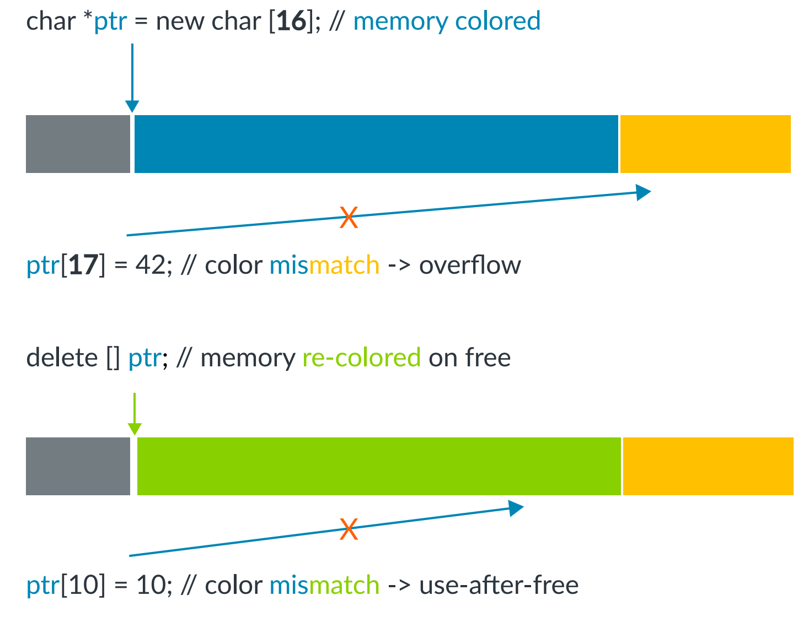
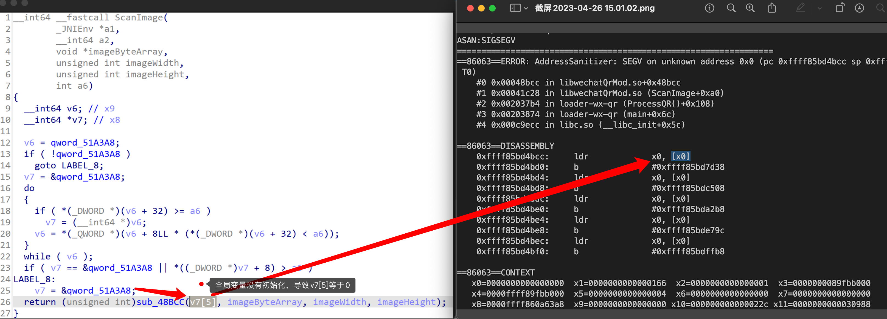

# Final Project 列表与要求

## 1. 软件供应链安全相关Project

### 1.1 面向垂直领域的供应链分析
背景：当前复杂软件系统多均依赖第三方组件构建其功能，形成软件供应链。而这些第三方组件会存在漏洞，引入一系列的安全问题。针对垂直领域的软件系统进行软件成分分析是当前的一个研究热点。

描述：从鸿蒙系统，云原生系统，AI系统，Web系统等垂直领域类中选一个类系统，收集相关成分分析论文，进行软件成分分析。

里程碑：综述、系统爬取、工具实现、系统分析；  
中期（第3周）完成：综述、系统爬取  
期末（第6周）完成：工具实现、系统分析；

参考文档： 

1. An Exploratory Study of Deep Learning Supply Chain

### 1.2 编程语言分析工具
背景：当前软件系统功能日益复杂，代码量大，通过人工遍历所有代码已不可行。因此研究人员提出静态技术对代码进行分析，无需运行代码，具有可扩展性强，效率高等特点。

描述：从Java、Rust、NPM、Go、Python中选择一门语言，收集相关静态分析论文，对分析工具进行复现，进而分析到整个语言生态的软件包。

里程碑：综述、系统爬取、工具实现、系统分析；  
中期（第3周）完成：综述、系统爬取  
期末（第6周）完成：工具实现、系统分析；

参考文档： 

1. MirChecker: Detecting Bugs in Rust Programs via Static Analysis
2. RUDRA: Finding Memory Safety Bugs in Rust at the Ecosystem Scale

### 1.3 Rust/C跨语言调用分析

背景：Rust通常用于比较底层的项目，与C的语言规范相近，因此开发者为避免重写代码会重用C代码，因此会使用跨语言调用机制。如果C语言部分存在问题，或者跨语言接口抽象存在问题，都是难以修复或者滞后修复的。

描述：因此我们需要分析Rust生态中的library以及面向用户的Rust应用使用跨语言调用的情况，找到真实的CVE，同时设计PoC对CVE进行利用，并给出防护思路。

里程碑：综述、PoC实现、多个PoC，防护思路；

中期（第3周）完成：综述、PoC实现  
期末（第6周）完成：多个PoC，防护思路

参考文档： 
1. Cross-Language Attacks, NDSS 22

## 2. 操作系统安全相关Project

### 2.1 基于eBPF的内核状态监控与防护 

背景：Extended Berkeley Packet Filter(eBPF)是一个Linux子系统，它允许在不修改内核的前提下，在内核中动态加载并安全地执行不受信任的用户自定义扩展。尽管允许用户在内核中执行任意代码一直被认为是不明智的，但BPF通过一系列的机制(verifier)确保了安全性。如今eBPF在系统跟踪、观测、性能调优、网络和安全等领域发挥重要的角色，孵化了很多知名项目，如cilium，sysdig falco等，有人甚至提出eBPF可能会促进微内核化的进程，并称其为超能力。eBPF提供的针对内核与用户进程的高可观测性对复杂环境(如云原生环境)的性能、安全等的监视与防护具有重要意义，而其在安全领域的潜在恶意利用，也引起了广泛的关注。

描述：本项目通过层层递进的方式逐渐深入BPF的内核观测与保护，涵盖了eBPF的各个方面，包括：观测，防护，自定义内核处理逻辑，配套工具使用和前沿探索性质的研究。

里程碑：

1. 理解内核中BPF的作用原理，包含sysdig falco架构（综述）。
2. 参考sysdig falco，实现eBPF程序，观测不少于5种内核数据（实现）。

中期（第3周）完成：综述  
期末（第6周）完成：实现

参考文档：

1. Calavera D, Fontana L. Linux Observability with BPF: Advanced Programming for Performance Analysis and Networking[M]. O'Reilly Media, 2019.
2. Gregg B. BPF Performance Tools[M]. Addison-Wesley Professional, 2019.
3. Vieira M A M, Castanho M S, Pacífico R D G, et al. Fast packet processing with ebpf and xdp: Concepts, code, challenges, and applications[J]. ACM Computing Surveys (CSUR), 2020, 53(1): 1-36.
4. [Brendan Gregg's Homepage](https://www.brendangregg.com/index.html)
5. [BPF Compiler Collection (BCC)](https://github.com/iovisor/bcc)
6. [Flame Graphs visualize profiled code](https://github.com/brendangregg/FlameGraph)
7. [云原生安全攻防｜使用eBPF逃逸容器技术分析与实践](https://security.tencent.com/index.php/blog/msg/206)
8. [内核态eBPF程序实现容器逃逸与隐藏账号rootkit](https://www.cnxct.com/container-escape-in-linux-kernel-space-by-ebpf/)
9. [Warping Reality - creating and countering the next generation of Linux rootkits using eBPF](https://defcon.org/html/defcon-29/dc-29-speakers.html#path)
10. [With Friends Like eBPF, Who Needs Enemies?](https://www.blackhat.com/us-21/briefings/schedule/#with-friends-like-ebpf-who-needs-enemies-23619)

### 2.2 基于eBPF的内核rootkit
背景：同上

描述：利用BPF实现rootkit，对cron无感知地插入后门，可以执行任意命令或向攻击方发起反向连接，并设计利用BPF的，对BPF恶意利用的检测系统框架(基于规则的面向BPF syscall的检测，如非预期用户挂载了敏感类型探针)

里程碑：

1. 理解内核中BPF的作用原理，收集2种已有的eBPF rootkit，阐述其原理（综述）。
2. 扩展已有eBPF rootkit，实现2种新功能（实现）。

中期（第3周）完成：综述  
期末（第6周）完成：实现

参考文档：同上

### 2.3 基于MTE的内存完整性保护

背景：内存损坏漏洞仍然是最常见且后果最严重的漏洞之一，它既包括栈溢出、堆溢出等空间维度上的漏洞，也包括重复释放（Double-free）和释放后使用（Use-after-free）等时间维度上的漏洞。硬件厂商提出了不同种类的硬件支持来高效地缓解内存损坏漏洞，而Memory Tagging Extension（MTE）就是其中之一。

Arm在2019年发布的ARMv8.5硬件规范中首次提出了MTE，它用4个比特位对每16字节的内存进行着色，而指针的高位同样有4个比特位标记指针的颜色。如此，只有当指针颜色和内存颜色一致时访存操作才是合法的。

如上图所示，MTE同时能防护时空两个维度上的内存损坏漏洞，因此近年来受到工业界和学术界的广泛关注。然而，目前还缺乏可行的基于MTE的对内核内存进行实时保护的方法，由于内核安全的重要性和MTE硬件提供的高性能安全能力，如何将二者有机结合已经成为近年来研究的关注焦点。

描述：本项目旨在使同学们入门硬件辅助安全（Hardware-assisted security）这一热门领域，同时深入了解MTE这一新兴的硬件安全特性。

里程碑：
1. 阅读参考文档并收集更多的相关资料和文献，总结MTE的优缺点 (综述)
2. 成功编译支持MTE的Linux内核并在QEMU上运行，同时运行一个被保护的程序 （实现）。

中期（第3周）完成：综述  
期末（第6周）完成：实现

参考文档：  

1. [ARM MTE白皮书](https://developer.arm.com/-/media/Arm%20Developer%20Community/PDF/Arm_Memory_Tagging_Extension_Whitepaper.pdf)
2. [内存问题的终极武器——MTE](https://juejin.cn/post/7013595058125406238)
3. [Memory Tagging and how it improves C/C++ memory safety](https://arxiv.org/pdf/1802.09517.pdf)
4. [Memory Tagging Extension (MTE) in AArch64 Linux](https://www.kernel.org/doc/html/latest/arm64/memory-tagging-extension.html)
5. [Color My World: Deterministic Tagging for Memory Safety](https://arxiv.org/pdf/2204.03781.pdf)

### 2.4 基于CodeQL的MacOS数据流分析

**本项目不需要在苹果电脑或苹果操作系统上进行，CodeQL数据库由助教提供**

背景：CodeQL是一个静态分析引擎，其将代码转化成数据库的形式供研究人员进行查询。macOS于2000年由苹果公司发行，macOS系统采用混合内核架构，内核由macOS核心内核 (X is Not Unix，XNU) 和内核扩展 (Kernel Extension) 两部分构成。近年来，一部分研究人员使用CodeQL对XNU进行数据流分析，找到了不少漏洞。

描述：本项目通过了解CodeQL与XNU的基本知识，仿照已有研究结果进一步编写查询代码尝试对XNU进行数据流分析，从而寻找潜在的漏洞。

里程碑：
1. 阅读参考文档并搜集更多相关资料，总结CodeQL与现有通过CodeQL挖掘XNU漏洞工作的优缺点（综述）；
2. 构造 整数溢出/UAF/OOB (视难度三选二或者三选一) 的漏洞查询语句（实现）。

**漏洞查询语句通常只有几十行代码**

中期（第3周）完成：综述

期末（第6周）完成：实现

参考文档：

1. MUHE. [CodeQL XNU From 0 to 1](https://o0xmuhe.github.io/2021/02/15/CodeQL-XNU-From-0-to-1/). 2021.
2. Kevin Backhouse. Apple's XNU Kernel: Finding a memory exposure vulnerability with CodeQL (CVE-2017-13782). Github Securitylab, 2017.
3. Arsenii Kostomin. How to find multiple memory disclosures in XNU using CodeQL. ZER0CON 2023.
4. Kevin Backhouse. Kernel crash caused by out-of-bounds write in Apple's ICMP packet-handling code (CVE-2018-4407). Github Securitylab, 2018.

### 2.5 针对闭源软件的模糊测试

**背景**：模糊测试 (Fuzzing) 技术是一种自动化软件测试方法，通过向目标输入非法、畸形或非预期的输入，以发现软件缺陷和漏洞。近年来，随着针对开源软件Fuzzing的深入，针对**闭源**二进制软件也发展出较为成熟的灰盒Fuzzing技术，比如针对Windows的[1]。为提高Fuzzing效率，现代Fuzzing工具常引入反馈机制，根据程序的运行状态，评价测试输入的质量或调整输入的变异策略。代表性Fuzzer如AFL[2] 提出使用程序代码覆盖率作为反馈信号。代码覆盖率指针对一次输入，对PC寄存器（x86/x64的EIP/RIP）进行采样。通过代码覆盖率能分析程序的运行情况（针对当前的测试输入，能够获得程序走了多少代码）。

**描述**：

一、主流的Fuzzing工作最为重要就是做到代码覆盖率的采集，但想要做到这件事情还需要考虑到性能需求、实现难度等等。比如针对三星Android 10的闭源库，通过复现已有工作（编写loader程序动态链接闭源库来调用闭源库中的函数，而不是在安卓模拟器中进行fuzzing，以提升fuzzing的速度），7小时4核并行能挖到12个导致crash的潜在漏洞。

二、针对近期Android、IOS版微信在扫描如下二维码（或从聊天框打开该图片）就会崩溃的情况，助教改写了之前的loader使其调用微信的扫码模块，以便对微信的扫码模块进行Fuzzing。即便后续报道[3]出微信的二维码扫描代码是开源的，不需要使用灰盒Fuzzing方法，但使用灰盒Fuzzing的方法可以对几乎任意的二进制进行测试，所以这也是有意义的。比如做完微信的，使用同一套方法可以去测试美团、支付宝、淘宝等等任意拥有二维码扫描功能的App。同时，不只是二维码扫描，只要是涉及到图片、音频、视频等编码解码 (codec) 的闭源库都可以用同一套方法进行Fuzzing。

但和三星闭源库fuzzing不同，这里使用loader调用微信的闭源库存在全局变量初始化的问题（下图`qword_51A3A8`没有初始化），如果直接调用微信扫描二维码的接口`ScanImage`便会导致程序出现正常运行时不应该存在的崩溃（下图crash的汇编代码中`x0`便是IDA中的`v7[5]`），导致无法进行正常的fuzzing。

里程碑（**2、3任选其一**）：

1. 阅读参考文档并搜集更多相关资料，总结现有针对Windows、Android闭源库、MacOS等的Fuzzing工作（综述）；
2. （**可选**）复现一个近期对 Windows 或 Android闭源库 或 MacOS等 的Fuzzing的工作（复现）；
3. （**可选**）探究如何运行微信扫码模块的fuzzing（可以考虑的方法大致有三种: 1. 不使用loader，而使用Frida Fuzzer[4]等工具在安卓模拟器中进行fuzzing；2. 加入JVM的支持，编写Java配置程序与loader程序完成全局变量的初始化、动态链接闭源库来调用闭源库中的函数；3. 逆向微信如何做的全局变量/配置初始化，然后在loader程序调用微信二维码库进行对应的初始化）（创新）；

中期（第3周）完成：1 (综述)

期末（第6周）完成：2**或**3 （复现**或**创新）

参考文档：

1. WINNIE: Fuzzing Windows Applications with Harness Synthesis and Fast Cloning. NDSS 2021.
2. [American fuzzy lop: A security-oriented fuzzer](https://github.com/google/AFL)
3. [微信二维码崩溃后续 转发一个靠谱的分析](https://mp.weixin.qq.com/s/0Q_jLiZqyaULchFIwTR3bg)
4. [idhyt/AndroidFridaFuzz: android app native so fuzz. efficiently run in a real machine with frida environment. (github.com)](https://github.com/idhyt/AndroidFridaFuzz)

## 3. 系统安全与AI交叉Project
### 3.1 基于大模型的软件漏洞检测
背景：随着ChatGPT的风靡，现在已有一些工作将其应用到安全上，取得了一些初步的成果。然而大模型和ChatGPT如何与安全结合依然需要更多研究。

描述：本项目旨在鼓励同学们探索将AI与安全结合的新型方式。

里程碑：
1. 查阅相关资料、论文，总结现有工作如何结合AI与安全；
2. 对现有结果进行复现；
3. 将技术扩展到新的领域；
4. 获得新的结果。

中期（第3周）完成：1，2  
期末（第6周）完成：3，4

参考文档：

1. Lost at C: A User Study on the Security Implications of Large Language Model Code Assistants
2. https://medium.com/codex/chatgpt-detects-vulnerabilities-in-npm-and-python-packets-2156aeafc6d6

### 3.2 基于大模型的系统设计
背景：同上

描述：本项目旨在鼓励同学们将AI作为工具，应到到系统安全设计中。

里程碑：
1. 查阅相关资料、论文，总结在系统安全中如何应用ChatGPT；
2. 对现有结果进行复现；
3. 将技术扩展到新的领域；
4. 获得新的结果。

中期（第3周）完成：1，2
期末（第6周）完成：3，4

参考文档：

https://www.bilibili.com/video/BV19h4y1W7th/

### 3.3 基于大模型的逻辑漏洞检测

背景：
逻辑漏洞危害严重，传统静态分析方法不能理解代码逻辑，难以实现逻辑漏洞的自动化检测。大模型具有代码逻辑理解能力，已有科研成果表明大模型具备实现代码逻辑理解与逻辑漏洞自动化检测的能力（如针对智能合约代码的GPTScan）。

描述：
本项目旨在使同学们结合传统分析与大模型，针对现有开源项目代码上的各类逻辑类漏洞，开展自动化检测技术的研究，弥补技术空白。针对权限校验、身份验证、支付逻辑3类逻辑问题实现自动化漏洞检测。
里程碑：收集开源逻辑漏洞数据集、大模型训练与评估、系统分析；

参考文档：

GPTScan: Detecting Logic Vulnerabilities in Smart Contracts by Combining GPT with Program Analysis
https://mp.weixin.qq.com/s/kZfsa7oi_e9rTTjSQR7mXg

LineVul: A Transformer-based Line-Level Vulnerability Prediction

### 3.4 基于人工智能的漏洞代码检测定位

背景：
人工开展代码漏洞挖掘费时费力，传统静态漏洞检测能够实现自动化识别疑似漏洞点，但误报率较高且难以检测复杂的上下文漏洞。基于人工智能的漏洞代码检测定位具有理解代码上下文相关性并对特征进行多层概括和抽象的能力，通过模型的自身泛化能力自动检测代码中相似的漏洞，可代替人工开展疑似漏洞确认，有效提高检测效率。

描述：
本项目旨在使同学们了解漏洞挖掘的基本知识，学习训练深度学习模型进行漏洞检测任务。更进一步尝试通过多种模型优化策略提升模型定位漏洞的效果，比如进行更细粒度的程序切片、使用包含更多语义信息的代码标识方法、提高模型识别漏洞根因位置的能力等。
里程碑：收集漏洞标注数据集、模型训练与评估、系统分析

参考文档：

VulChecker: Graph-based Vulnerability Localization in Source Code
https://github.com/ymirsky/VulChecker

Devign: Effective vulnerability identification by learning comprehensive program semantics via graph neural networks

## 4. MCU rehosting 相关Project

### 4.1 基于emulater的外设支持

背景：
由于硬件和固件之前的紧密耦合，以及缺乏外设模型支持，微控制器（MCU）的固件模拟具有一定挑战性。这也极大的阻碍了动态分析工具在固件分析中的应用，影响了固件漏洞挖掘和其他安全分析的进展。因此，如何构建外设模型，模拟具有位置外设的固件是一个重要的研究问题。

描述：
本项目旨在使同学们深入理解嵌入式系统安全，掌握MCU的固件模拟及其外设支持。

里程碑：
1. 根据参考文档中的论文和其他相关论文，总结出模拟外设需要的条件，当前外设模拟的困难和不同方法的优缺点等重要内容 ，写一份简单但要点内容齐全的综述 
2. 根据所完成综述，复现一篇/多篇论文，并提出更优的方法运用其中

中期完成：里程碑1

期末完成：里程碑2

参考文档：

1. https://dl.acm.org/doi/pdf/10.1145/3433210.3453093
2. https://dl.acm.org/doi/pdf/10.1145/3423167
3. https://www.usenix.org/system/files/sec20-feng.pdf
4. https://www.usenix.org/system/files/sec21-zhou.pdf
5. https://dl.acm.org/doi/pdf/10.1145/3545948.3545957

### 4.2 支持多种处理器架构的MCU rehosting框架

背景：
大多数rehosting框架只支持ARM或x86等常见架构，但在一些特定场景下，有许多非常规架构的固件。例如智能互联网汽车的场景中，有C166，RH850，V850，SH-2A等汽车固件中的特定架构。如何针对这些架构的MCU进行rehosting具有挑战性，也同时是一项研究重点。
描述：本项目旨在使同学们深入理解不同架构的MCU如何rehosting，学习如何构建architecture- agnostic的MCU rehosting的框架，并在此基础上对固件进行动态分析，例如fuzzing

里程碑：
1. 构建支持多种处理器架构的MCU rehosting框架 
2. 在该框架上对固件进行动态分析如fuzzing

中期完成：里程碑1

期末完成：里程碑2

参考文档：

1. https://dl.acm.org/doi/pdf/10.1145/3433210.3453093
2. https://dl.acm.org/doi/pdf/10.1145/3423167
3. https://arxiv.org/pdf/2208.03528
4. https://arxiv.org/pdf/2301.13346

## 5. Android系统相关Project

### 5.1 Android应用第三方库检测

背景: 第三方库（TPL）给Android应用程序提供了可重用的功能，极大的促进了Android应用的开发，已经成为移动生态系统中必不可少的组成部分。然而，TPL的广泛使用也会引入相关安全问题，应用程序中TPL组件信息并非是透明的，甚至开发人员可能也不知道使用了哪些TPL，检测Android应用中的TPL对于恶意软件检测、隐私泄露检测等下游任务至关重要。

描述: 本项目旨在使同学们入门Android系统安全领域，了解Android应用的体系结构，同时深入探究Android应用第三方库的检测方法。

里程碑:

1. 阅读参考文档并收集更多相关资料和文献，总结Android第三方库检测方法及其优缺点（综述）；
2. 复现近期针对Android第三方库检测的工作（复现）；
3. 提出具有混淆弹性，能识别动态加载的TPL的检测思路 （思路）。

中期（第3周）完成：1 

期末（第6周）完成：2，3 

参考文档:

1. Zhan X, Fan L, Liu T, et al. Automated third-party library detection for android applications: Are we there yet?[C]//Proceedings of the 35th IEEE/ACM International Conference on Automated Software Engineering. 2020: 919-930.
2. Zhan X, Fan L, Chen S, et al. Atvhunter: Reliable version detection of third-party libraries for vulnerability identification in android applications[C]//2021 IEEE/ACM 43rd International Conference on Software Engineering (ICSE). IEEE, 2021: 1695-1707.
3. Wu Y, Sun C, Zeng D, et al. LibScan: towards more precise third-party library identification for android applications[C]//Proceedings of the 32nd USENIX Conference on Security Symposium. 2023: 3385-3402.

### 5.2 Android应用逃逸技术检测

背景:

随着 Android 应用程序使用量的持续增长，确保Android应用的安全性至关重要，相关研究通过动静态分析的方法检测Android恶意应用或隐私泄漏等。然而，越来越多的恶意应用程序采用逃逸技术（反分析技术）来逃避安全分析。

描述:

本项目旨在使同学们了解Android应用分析技术，同时深入探究Android应用的逃逸技术。

里程碑:

1. 阅读参考文档并收集更多相关资料和文献，对Android应用使用的逃逸技术及其实现方法进行收集和分类总结；
2. （可选）复现检测Android应用逃逸技术的工作（复现）；
3. （可选）实现一个可以检测部分Android应用逃逸技术的工具（实现）。

中期（第3周）完成：1 

期末（第6周）完成：2或3 

参考文档:

1. Xue L, Zhou H, Luo X, et al. Happer: Unpacking android apps via a hardware-assisted approach[C]//2021 IEEE Symposium on Security and Privacy (SP). IEEE, 2021: 1641-1658.
2. Kondracki B, Azad B A, Miramirkhani N, et al. The droid is in the details: Environment-aware evasion of android sandboxes[C]//Proceedings of the 29th Network and Distributed System Security Symposium (NDSS). 2022.
3. Afonso V, Kalysch A, Müller T, et al. Lumus: Dynamically uncovering evasive Android applications[C]//Information Security: 21st International Conference, ISC 2018, Guildford, UK, September 9–12, 2018, Proceedings 21. Springer International Publishing, 2018: 47-66.
4. Hammad M, Garcia J, Malek S. A large-scale empirical study on the effects of code obfuscations on android apps and anti-malware products[C]//Proceedings of the 40th international conference on software engineering. 2018: 421-431.

## 6. Groups

1.1   
1.2   
1.3  

2.1   
2.2  
2.3    
2.4  
2.5 

3.1   
3.2 
3.3 
3.4 

4.1 
4.2

5.1 
5.2

